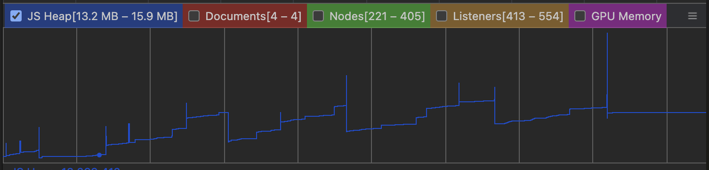

# overlay-kit memory leak

### How to repro automatically

- `pnpm install`
- `pnpm run test`
- Check the test result

### How to repro manually

- `pnpm install`
- `pnpm run dev`
- Enter `http://localhost:5173`
- Click link `Page1`
- Click `open modal` button
- Click `close modal` button
- Click link `Page2`
- Repeat above until `Page5`
- Click link `Home`
- Click link `Outside OverlayProvider` (for unmounting `OverlayProvider`)
- Click link `Home`
- You can see the `overlayId`s in the screen

### Memory Profiling

- chrome devtools > Performance tab > Record > Step `How to repro manually` above > Stop Profiling > Check `JS Heap`

